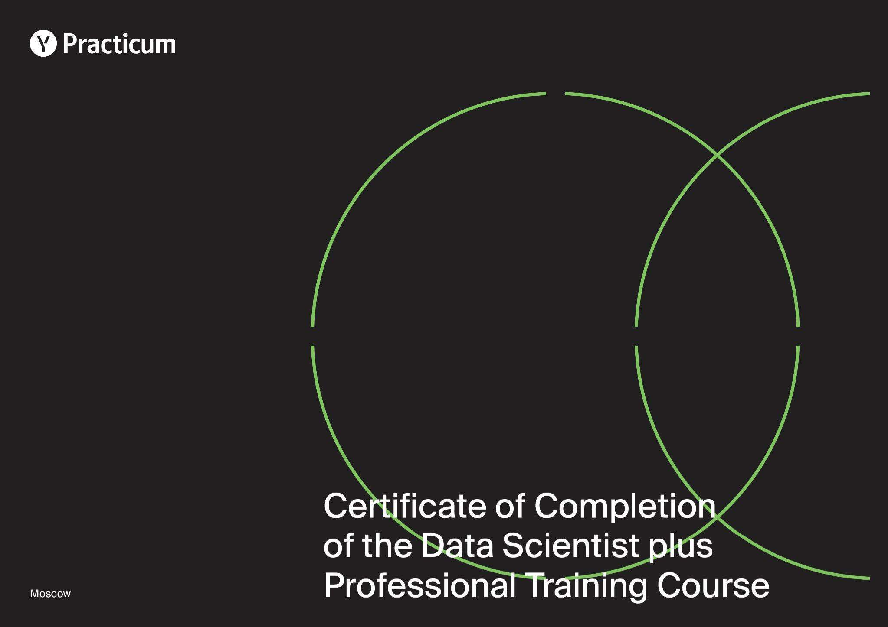
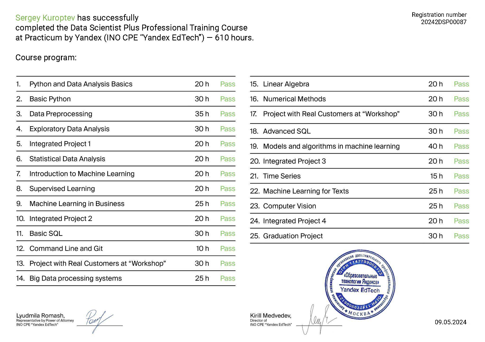

# Yandex Practicum: Data Scientist Plus Professional Training Course.

## Projects completed during the course
| Title (project link) | Description | Stack |
|:--|:--|:--|
|[Customer age prediction by photo.](https://github.com/mrBrain101/Yandex_Practicum_projects/tree/5d79f8a21b82eb9fc00f63238b5073641c7424ec/CV_Age_by_Photo_Prediction)| ResNet50 model was built with initialization of imagenet weights and specified “head”. | <li>Tensorflow.<li>PIL.<li>Pandas. <li>Matplotlib. <li>Seaborn. <li>Numpy. |

## Certificate

## Program

