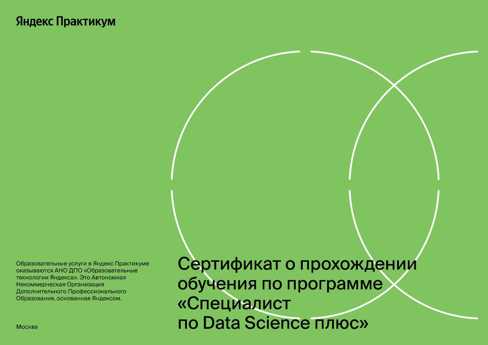

# Yandex Практикум: Курс "Специалист по Data Science плюс".

## Описание проектов
| Название (ссылка) | Описание | Стек |
|:--|:--|:--|
|[Определение возраста покупателей.](https://github.com/mrBrain101/Yandex_Practicum_projects/tree/677e8370dee0aadea6a333ea7df9ac2beb0f571f/CV_Age_by_Photo_Prediction)| Для определения возраста по фотографии была построена модель ResNet50 c инициализацией весов imagenet и заданной "головой".|Tensorflow. PIL. Pandas. Matplotlib, Seaborn. Numpy.|
|[Поиск изображений по запросу.](https://github.com/mrBrain101/Yandex_Practicum_projects/tree/677e8370dee0aadea6a333ea7df9ac2beb0f571f/CV_NLP_Prompt_image_matching)| Для демонстрационной версии была обучена MVP-модель, способная по векторному представлению изображения и векторному представлению текста, выдать число от 0 до 1 — показать, насколько текст и картинка подходят друг другу.| PyTorch, TorchVision.  Scikit-Learn: LinearRegression, ElasticNet.  CatBoostRegressor. Spacy. PIL. Transformers. Pandas.  Matplotlib, Seaborn.  Numpy.  OS, Requests.|
|[Защита клиентских данных.](https://github.com/mrBrain101/Yandex_Practicum_projects/tree/677e8370dee0aadea6a333ea7df9ac2beb0f571f/Math_Customer_Data_Protection)| Была доказана эффективность алгоритма защиты данных с помощью умножение независымых признаков на обратимую матрицу.  Было доказано, теоретически и практически, что эффективность линейной регрессии при такой трансформации предикторов не снижается.|Scikit-Learn: LinearRegression. Pandas.  Matplotlib.  Numpy. Latex.|
|[Прогнозирование оттока клиентов банка.](https://github.com/mrBrain101/Yandex_Practicum_projects/tree/677e8370dee0aadea6a333ea7df9ac2beb0f571f/ML_Bank_Churn)| Была подобрана модель случайного леса, её гиперпараметры и оптимальный метод для борьбы с дисбалансом классов для максимизации метрики _F1_.|Pandas. Numpy. Matplotlib, matplotlib_venn, Plotly, Cufflinks, Seaborn. Requests. Scikit-Learn.|
|[Прогнозирование риска ДТП.](https://github.com/mrBrain101/Yandex_Practicum_projects/tree/677e8370dee0aadea6a333ea7df9ac2beb0f571f/ML_Car_Accident_Risk_Prediction)| Была создана MVP система оценки риска ДТП по выбранному маршруту.|CatBoost. Scikit-Learn's pipelines, DecisionTreeClassifier, RandomForestClassifier. SQLAlchemy. Pandas. PhiK. Optuna. Plotly, Matplotlib, Seaborn. Numpy. OS.|
|[Предсказание стоимости подержанных автомобилей.](https://github.com/mrBrain101/Yandex_Practicum_projects/tree/677e8370dee0aadea6a333ea7df9ac2beb0f571f/ML_Car_Price_Prediction)| Для прогнозирования цены подержанного автомобиля покупателя была создана модель LightGBM с RMSE 1532 евро и коэффициентом R2 0,89.|Scikit-Learn's LinearRegression, DecisionTreeRegressor, HistGradientBoostingRegressor. CatBoost. LightGBM. Optuna hyperparameter search.  PhiK correlation analisys.  Pandas.  Scipy.  Matplotlib, Seaborn.  Numpy.  OS, Requests.|
|[Прогнозирование оттока клиентов отеля.](https://github.com/mrBrain101/Yandex_Practicum_projects/tree/677e8370dee0aadea6a333ea7df9ac2beb0f571f/ML_Hotel_%D0%A1hurn)| Была разработана прибыльная система предсказаний отмены бронирования. Был проведён исследовательский анализ и составлен портрет "ненадёжного" клиента.|Pandas. Numpy. Matplotlib, matplotlib_venn, Plotly, Cufflinks, Seaborn. OS, Requests, Multiprocessing. Scikit-Learn's HalvingGridSearchCV, DecisionTreeClassifier, RandomForestClassifier, HistGradientBoostingClassifier.|
|[Мэтчинг товаров.](https://github.com/mrBrain101/Yandex_Practicum_projects/tree/677e8370dee0aadea6a333ea7df9ac2beb0f571f/ML_Matching)| Для максимизации метрики $accuracy@5$ при мэтчинге товаров, был разработан алгоритм `FAISS` с индексом `IVF1600,Flat`.|Scikit-Learn's KMeans, MiniBatchKMeans.  FB's FAISS.  Spotify's ANNOY.  Pandas.  Scipy.  PhiK.  Matplotlib, Seaborn.  Numpy. |
|[Прогнозирование рентабельности расположения нефтяных скважин. ](https://github.com/mrBrain101/Yandex_Practicum_projects/tree/677e8370dee0aadea6a333ea7df9ac2beb0f571f/ML_Oil_Economy_Bootstrap)| Для прогнозирования рентабельности нефтяных скважин была построена модель линейной регрессии.|Scikit-Learn's LinearRegression, Pipeline, StandardScaler, r2_score, mean_squared_error.  Pandas.  Matplotlib, Seaborn.  Numpy.  OS.  Requests. TQDM.|
|[Предсказание стоимости жилья.](https://github.com/mrBrain101/Yandex_Practicum_projects/tree/677e8370dee0aadea6a333ea7df9ac2beb0f571f/ML_SPARK_Realty_Price_Prediction)| Для определения цен на недвижимость были построены модели регрессии.|PySpark: SQL, MLib. Pandas.  Numpy. Matplotlib, Seaborn.|
|[Предсказание температуры звезд.](https://github.com/mrBrain101/Yandex_Practicum_projects/tree/677e8370dee0aadea6a333ea7df9ac2beb0f571f/ML_Star_Temp_Prediction)| Для предсказания абсолютной температуры на поверхности звезды была разработана полносвязная нейронная сеть прямого распространения.|PyTorch (пользовательский класс, совместимый с Scikit-Learn Pipeline). Scikit-Learn's pipelines. Pandas. PhiK. Plotly. Matplotlib, Seaborn. Numpy. OS, Requests.|
|[Прогнозирование оттока клиентов в телекоме.](https://github.com/mrBrain101/Yandex_Practicum_projects/tree/677e8370dee0aadea6a333ea7df9ac2beb0f571f/ML_Telecom_Churn_Prediction)| Для предсказания оттока клиентов, была построена модель, с _ROC AUC_ = 0.84, _accuracy_ - 0.77.|OS, Multiprocessing, SQLAlchemy, Psycopg2. Pandas, Numpy. Phik, Shap. Matplotlib, Seaborn. Scikit-Learn, CatBoost, Category Encoders. ydata_synthetic. Optuna, TQDM.|
|[Прогнозирование спроса (временные ряды).](https://github.com/mrBrain101/Yandex_Practicum_projects/tree/677e8370dee0aadea6a333ea7df9ac2beb0f571f/ML_Time_Series_Analysis_Taxi)|Была разработана модель прогнозирования кол-ва заказов такси Prophet.|Prophet. Scikit-Learn.  LSTM on PyTorch.  CatBoost. Pandas.  Statsmodels.  PhiK.  Matplotlib, Seaborn.  Numpy.|
|[Классификация токсичных комментариев.](https://github.com/mrBrain101/Yandex_Practicum_projects/tree/677e8370dee0aadea6a333ea7df9ac2beb0f571f/NLP_Toxic_Commentaries_Classification)|Для классификации токсичных комментариев была использована модель оценки токсичности комментариев _toxic-bert_ и применена логистическая регрессия: _F1_= 0.93. |PyTorch. NLTK. Spacy. Detoxify. Bert, ToxicBert. Scikit-Learn: LogisticRegression, TfidfVectorizer, CountVectorizer.  CatBoostClassifier. Transformers. Pandas.  Matplotlib, Seaborn.  Wordcloud. Numpy.  IO, OS, Requests.|
|[Статистический анализ поведения клиентов приложения для самокатов.](https://github.com/mrBrain101/Yandex_Practicum_projects/tree/677e8370dee0aadea6a333ea7df9ac2beb0f571f/Stats_Scooter_App_Research)|Был проведён анализ поведения клиентов сервиса аренды самокатов.|Pandas, Numpy. Matplotlib, Seaborn, Cufflinks. Scipy, Math.|

## Сертификат

## Программа

